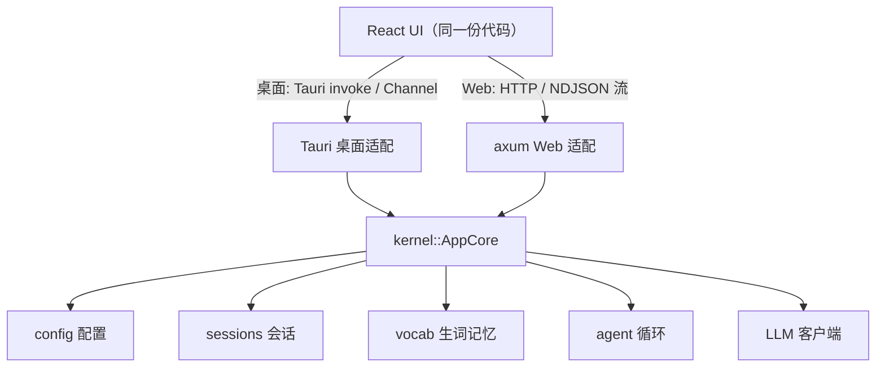

<div align="center">

<picture>
  <source media="(prefers-color-scheme: dark)" srcset="docs/wordmark-dark.png" />
  
</picture>

<br/>

**不只是翻译，是一位懂你水平的英语私教。**

逐句对照翻译，卡片式讲解每个生词与地道表达；记住你标记的每一个词，越用越懂你的水平；随时无缝切换大模型对话模式，共享上下文。

<br/>


</div>

---

## ✨ 全平台使用

> **同一个 Glossa，桌面、浏览器、手机无缝流转 —— 电脑上标的生词，手机打开就在。**

这不是三个套壳应用，而是**一套 Rust 内核 + 一份 React 界面**跑在所有平台上：

| 🖥️ **桌面端** | 🌐 **浏览器** | 📱 **手机** |
|:---:|:---:|:---:|
| Linux · Windows · macOS<br/>原生 Tauri 应用，单文件、零依赖 | 一行命令起服务<br/>任何浏览器直接访问 | 连同一 WiFi<br/>手机浏览器即用，自适应触屏 |

**数据同源** —— 桌面端和 Web 端读写同一份生词本与会话，改一处，处处更新。

## 为什么用 Glossa

**翻译工具给你答案，Glossa 让你进步。**

- **📖 结构化讲解，不是一坨译文** —— 长段落逐句对照；IELTS 7+ 的词汇自动生成词卡（音标 / 词性 / 语境释义 / 例句）；原句里的习语、固定搭配、地道句式单独摘出来讲。
- **🧠 会成长的私教** —— 一键标记生词、地道用法、整句收藏。你的标记会成为模型的记忆：生词本偏简单，它讲得更细、选词更基础；生词本进阶，它只挑更高阶的点。**用得越久，越懂你。**
- **💬 翻译与追问无缝切换** —— 同一个输入框，`Ctrl+M` 在「翻译」和「聊天」间切换。聊天时自动带上本次翻译的上下文，可以就任何一个词、一个句子继续深挖。
- **🔌 接你自己的模型** —— 任何 OpenAI 兼容 API 都行（默认 DeepSeek）。API key 存在你自己机器上，对话不经过任何第三方。
- **🎨 好看，且护眼** —— 内置 Gruvbox 与 Catppuccin 四套主题，深浅随心。

## 安装

### Linux / macOS —— 一行命令

```sh
curl -fsSL https://raw.githubusercontent.com/xyt-dev/Glossa/master/install.sh | sh
```

安装后运行 `glossa` 打开桌面端。**重复运行这行命令即可更新到最新版。**

### Windows

从 [**Releases**](https://github.com/xyt-dev/Glossa/releases) 下载 `.msi` 或 `-setup.exe` 双击安装。
（Windows 10 需要 WebView2 Runtime，安装器会自动引导。）

### 📱 在手机上用

Glossa 自带 Web 服务，手机连同一 WiFi 即可访问：

```sh
glossa web                 # 电脑上运行，默认端口 8040
```

终端会打印局域网地址，手机浏览器打开 `http://<电脑IP>:8040/` 即可。
需要鉴权时设置 `GLOSSA_TOKEN=你的口令 glossa web`，访问时加 `?token=你的口令`。

也可以在桌面端 **设置 → Web 服务** 里开启，随应用一起启动。

## 配置

首次运行生成带注释的配置文件（Linux `~/.config/glossa/config.toml`，
Windows `%APPDATA%\glossa\`，macOS `~/Library/Application Support/glossa/`），
也可在应用内「设置」里改：模型、API key、思考强度、选词难度、主题、Web 端口……

API key 直接填入配置，或留空并导出环境变量（默认 `DEEPSEEK_API_KEY`）。
生词本和会话都是纯 JSON，存在本地，可自由备份、同步、手改。

## 架构

Glossa 的核心是一个 **UI 无关的 Rust 内核**（`kernel::AppCore`）—— 配置、模型客户端、
结构化解析、生词记忆、会话存储、agent 循环全在这里。桌面端与 Web 端都只是它之上
几十行的薄适配层，前端是同一份 React 代码，运行时自动识别环境。



```
crates/kernel    纯 Rust 核心（可接任意前端）
crates/server    Web 适配：REST + NDJSON 流式 + 内嵌前端
src-tauri        桌面适配：Tauri 2
ui               React 19 + Vite + TypeScript
```

**一套核心逻辑，桌面 / Web / 移动端共享 —— 这是 Glossa 能在所有平台保持一致的原因。**

## 从源码构建

需要 Rust stable + Node ≥ 20，Linux 另需 `webkit2gtk-4.1`。

```sh
npm --prefix ui install
cargo tauri dev              # 开发运行（桌面端热更新）
cargo run -p glossa-server   # 运行 Web 服务
cargo test -p kernel         # 核心库测试
```

## License

[MIT](LICENSE)
